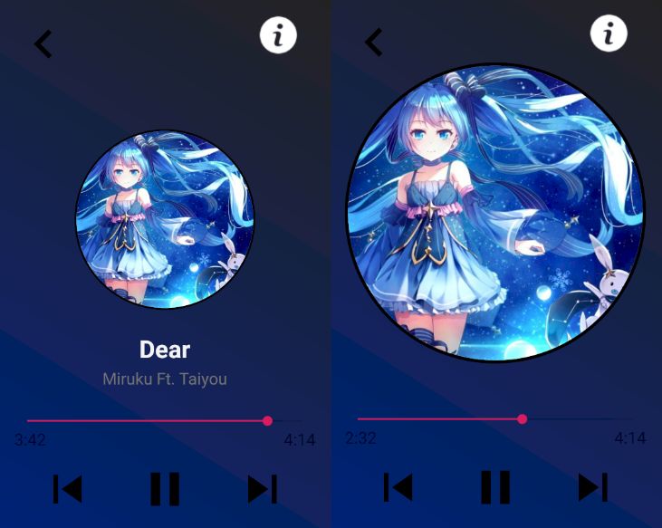
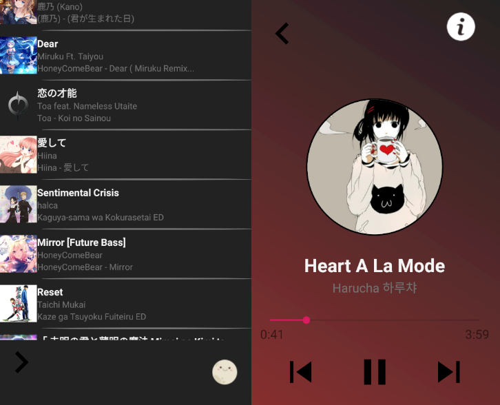
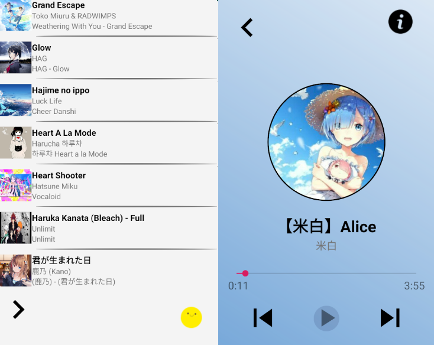

# Music Player
- Finds audio files from all storages on the Android device
- Can be played from notifications menu
- Audio focus supported
- Uses color palettes from the album art
- Light mode and Dark mode themes
- Easily accessible audio file details
- Create personalized queues and playlists

## Notification Menu

## Main Display

## Main Display Expanded

## Music Details

## Dark Mode

## Light Mode

## Queue/Playlist Selection Mode

