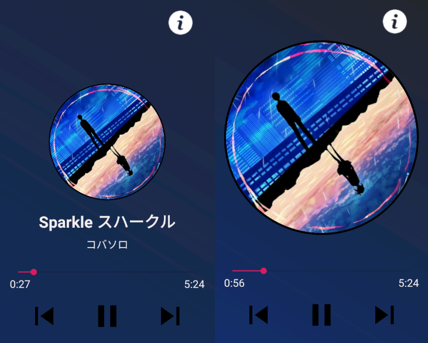
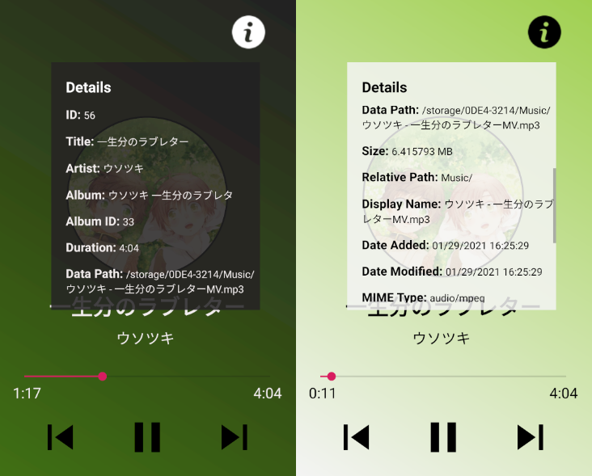
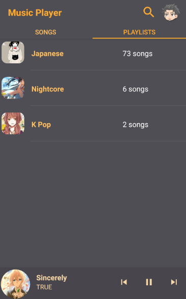

# Music Player
- Slideup panel UI
- Sliding Toolbar menu
- Finds audio files from all storages on the Android device
- Can be played from notifications menu
- Audio focus supported
- Local database storage of queues and playlists
- Uses color palettes from the album art
- Multiple themes (e.g. light and dark)
- Easily accessible audio file details
- Search for songs

## Notification Menu

## Multiple Themes

## Main Display

## Music Details

## Search Filter

## Action Mode (Create queues or playlists)

## Playlists

