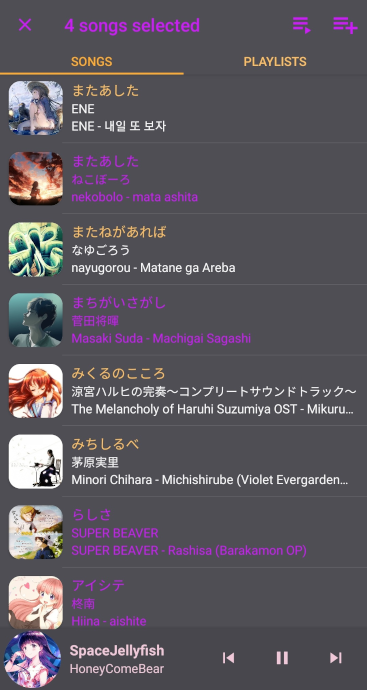

# Music Player
- Finds audio files (.mp3, .m4a, .wav, etc.) from all storages on the Android device
- Local database storage of queues and playlists
- Search, shuffle, repeat, and play songs offline
- Create timed playlists
- Can be played from notifications menu
- Audio focus supported
- Slideup panel UI
- Sliding Toolbar menu
- Uses color palettes from the album art
- Multiple themes (e.g. light and dark)
- Easily accessible audio file details

## Notification Menu

## Multiple Themes

## Main Display

## Playlists Tab

## Indexed Scrolling

## Music Details

## Timed Playlists

## Search Filter

## Action Mode (Create queues or playlists)

